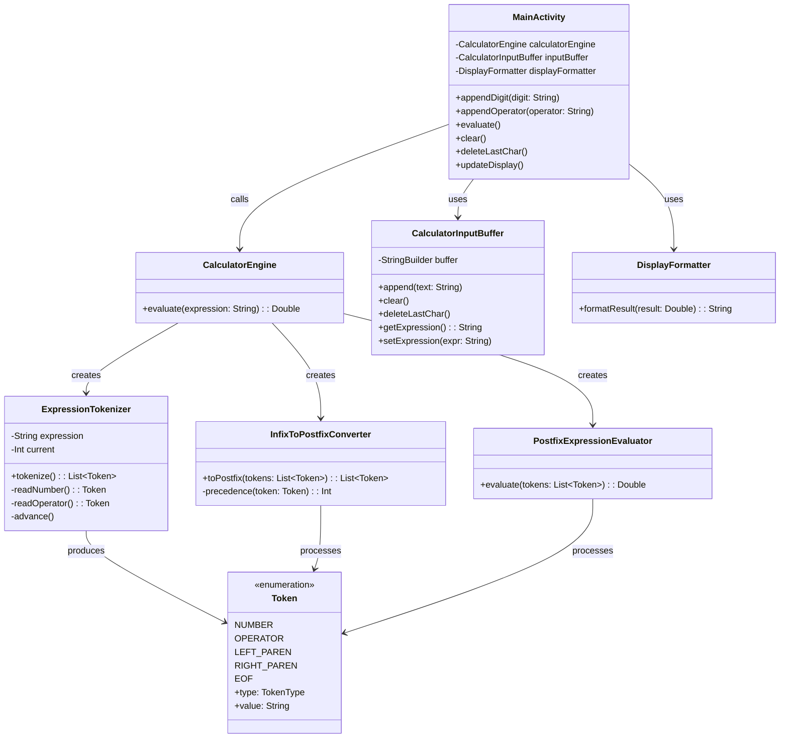
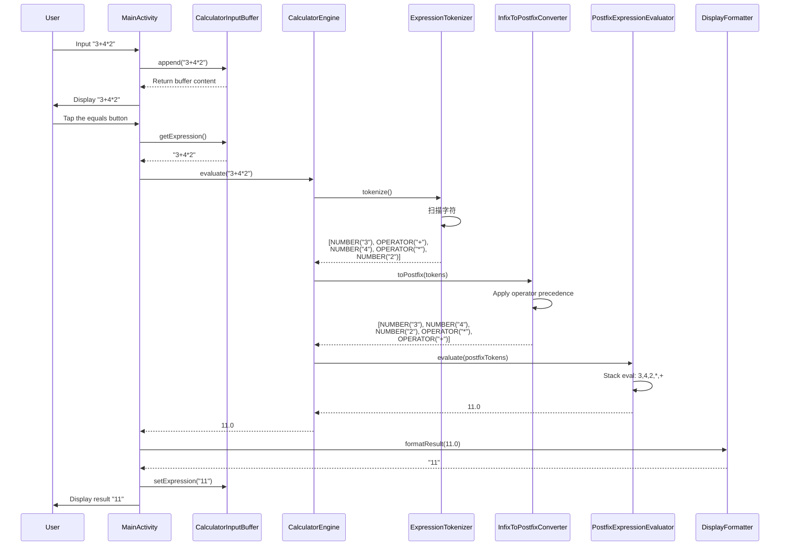
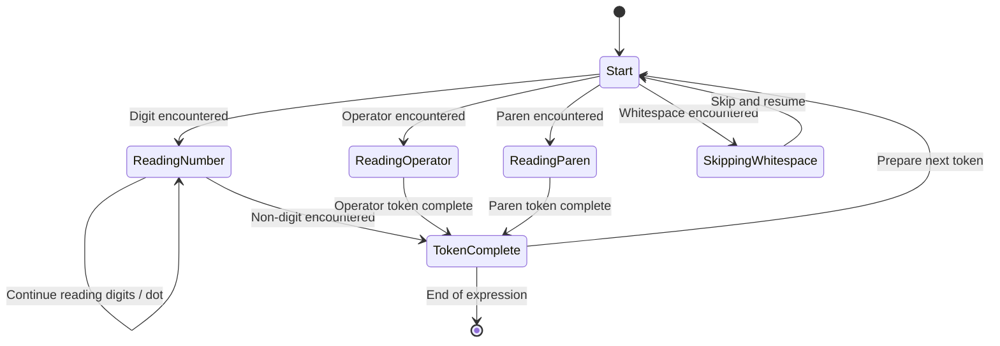

Code Analysis Result with kb-coder and MCP

## Calculator Code Flow Diagrams

### **1. Overall Architecture Flow**

```mermaid
graph TD
    A[UI MainActivity] --> B[User input events]
    B --> C{Button type}

    C -->|Digits / operators| D[CalculatorInputBuffer<br/>Append input]
    C -->|Equals (=)| E[Trigger evaluation]
    C -->|Clear (C)| F[Clear buffer]
    C -->|Delete (DEL)| G[Delete last character]

    D --> H[Update display]
    E --> I[Call CalculatorEngine.evaluate]
    F --> H
    G --> H

    I --> J[ExpressionTokenizer<br/>Tokenization]
    J --> K[InfixToPostfixConverter<br/>Infix → Postfix]
    K --> L[PostfixExpressionEvaluator<br/>Evaluate postfix]
    L --> M[Return result]

    M --> N[DisplayFormatter<br/>Format result]
    N --> O[MainActivity shows result]
    O --> P[Update input buffer]

    subgraph "Error Handling"
        Q[Exception during evaluation] --> R[MainActivity handles error]
        R --> S[Show error message]
        S --> T[Clear buffer]
        T --> U[Reset display]
    end
```

### **2. Calculator Engine Detailed Flow**

```mermaid
flowchart TD
    Start[Start] --> Input[Input expression string]

    Input --> Validate{Validate expression}
    Validate -->|Empty| Error1[Error: empty expression]
    Validate -->|Valid| Tokenize

    subgraph Tokenize[Tokenization]
        T1[Init tokenizer] --> T2[Scan characters]
        T2 --> T3{Character type}
        T3 -->|Digit / dot| T4[Read full number]
        T3 -->|Operator + - * /| T5[Read operator]
        T3 -->|Paren ( )| T6[Read paren]
        T3 -->|Whitespace| T7[Skip]
        T3 -->|Other| T8[Error: invalid character]
        T4 --> T9[Emit NUMBER token]
        T5 --> T10[Emit OPERATOR token]
        T6 --> T11[Emit PAREN token]
        T9 --> T12[Append to token list]
        T10 --> T12
        T11 --> T12
        T12 --> T13{Done?}
        T13 -->|No| T2
        T13 -->|Yes| T14[Append EOF token]
    end

    Tokenize --> Convert

    subgraph Convert[Infix → Postfix Conversion]
        C1[Init output list & operator stack] --> C2[Iterate tokens]
        C2 --> C3{Token type}
        C3 -->|NUMBER| C4[Append to output]
        C3 -->|OPERATOR| C5[Handle precedence]
        C5 --> C6[Pop higher-precedence ops to output]
        C6 --> C7[Push current operator]
        C3 -->|LEFT_PAREN| C8[Push left paren]
        C3 -->|RIGHT_PAREN| C9[Pop until left paren]
        C9 --> C10[Pop left paren]
        C3 -->|EOF| C11[Pop all remaining ops]
        C4 --> C12{Done?}
        C7 --> C12
        C8 --> C12
        C10 --> C12
        C11 --> C12
        C12 -->|No| C2
        C12 -->|Yes| C13[Return postfix expression]
    end

    Convert --> Evaluate

    subgraph Evaluate[Evaluation]
        E1[Init operand stack] --> E2[Iterate postfix tokens]
        E2 --> E3{Token type}
        E3 -->|NUMBER| E4[Convert to Double and push]
        E3 -->|OPERATOR| E5[Pop two operands]
        E5 --> E6{Operator}
        E6 -->|+| E7[Add]
        E6 -->|-| E8[Subtract]
        E6 -->|*| E9[Multiply]
        E6 -->|/| E10[Check divide-by-zero]
        E10 -->|Divide by zero| Error2[Error: divide by zero]
        E10 -->|OK| E11[Divide]
        E7 --> E12[Push result]
        E8 --> E12
        E9 --> E12
        E11 --> E12
        E4 --> E13{Done?}
        E12 --> E13
        E13 -->|No| E2
        E13 -->|Yes| E14[Check stack size]
        E14 -->|!= 1| Error3[Error: invalid expression]
        E14 -->|== 1| E15[Pop final result]
    end

    Evaluate --> Output[Return result]
    Error1 --> End[End]
    Error2 --> End
    Error3 --> End
    Output --> End
```

### **3. Class Diagram**



### **4. Data Flow (Sequence)**



### **5. State Diagram (Tokenizer)**



### **6. How to View the Diagrams**

You can copy the Mermaid blocks above into any of the following to render the diagrams:

1. **GitHub/GitLab**: paste into a Markdown file
2. **Typora**: install/enable Mermaid support
3. **Obsidian**: Mermaid is built-in
4. **VS Code**: install a Mermaid preview extension (e.g. Markdown Preview Mermaid Support)
5. **Online editor**: use [Mermaid Live Editor](https://mermaid.live/)

### **7. Critical Path Summary**

```
User interaction path:
User → MainActivity → CalculatorInputBuffer → display update

Evaluation path:
MainActivity → CalculatorEngine → ExpressionTokenizer → 
InfixToPostfixConverter → PostfixExpressionEvaluator → 
DisplayFormatter → MainActivity → display result

Error-handling path:
Any component throws → MainActivity handles → show error → reset state
```

These diagrams show the complete calculator flow from user input to final display, including component interactions and data transformations.
